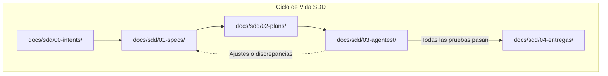

# AGENTS.md — Definición del Arnés y Roles de Agentes SDD

Bienvenido al arnés de gobernanza y desarrollo para el proyecto de integración **Placetopay (Evertec)** bajo la metodología **Spec-Driven Development (SDD)**, fundamentada en los principios de ingeniería de **Anthropic** y ejecutada en el entorno **Antigravity**.

---

## 1. Filosofía SDD: "Specify-and-Verify" (Cultura Anthropic)

Este proyecto rechaza terminantemente el *"vibe coding"* (desarrollo impulsivo sin especificación). Se establece una división de responsabilidades estricta:
1. **Intención y Especificación (El Qué):** Cada funcionalidad o fase nace de un `Intent` explícito y se modela en un `Spec` vivo, versionado y formal.
2. **Planificación y Desglose (El Cómo estructurado):** Se genera un `Plan` técnico que desglosa tareas, identifica deudas técnicas y lecciones aprendidas.
3. **Ejecución y Verificación (El Cómo validado):** Los agentes especializados ejecutan la tarea y la someten a una batería de **Agentest** (pruebas de aceptación y coherencia de agente).
4. **Entrega Condicional:** Ninguna fase emite un artefacto de `entrega` hasta que el 100% de los tests del `Agentest` reporten éxito. Si se detectan desvíos o nuevos requerimientos, se debate y se crea un nuevo Spec.

---

## 2. Guardrails Inmutables del Proyecto

Cualquier agente que opere en este repositorio debe respetar incondicionalmente las siguientes reglas:

| Guardrail | Regla Estricta | Consecuencia de Infracción |
| :--- | :--- | :--- |
| **G-01: Prohibición de NPM** | **PROHIBIDO** ejecutar `npm install`, `npm i`, `npm add` o `yarn`. Se debe usar exclusivamente `pnpm`. | El hook `preinstall` en `package.json` abortará la ejecución con código de error 1. |
| **G-02: Cuarentena de 48 Horas** | **PROHIBIDO** instalar paquetes npm que hayan sido publicados en las últimas 48 horas (2880 minutos). | Enforced vía `.npmrc` (`minimum-release-age=2880`) y `pnpm-workspace.yaml`. Previene ataques a la cadena de suministro. |
| **G-03: No Code Without Spec** | No se permite crear código de negocio o backend sin un `Spec` aprobado en `docs/sdd/01-specs/`. | Invalida el ciclo SDD. El agente `Quality-Agentester` rechazará la verificación. |
| **G-04: Protocolo de Entrega** | No crear archivos en `docs/sdd/04-entregas/` hasta que todos los tests de `docs/sdd/03-agentest/` hayan sido ejecutados y validados. | Violación de integridad de entrega. |
| **G-05: Trazabilidad Técnica** | Cada hallazgo, atajo temporal o decisión debe ser documentado en `DEUDAS_TECNICAS.md` o `LECCIONES_APRENDIDAS.md`. | Omisión de transparencia arquitectónica. |
| **G-06: Ramas por Spec y Merge Humano** | A partir de Spec-02, prohibido trabajar en `main`. Se debe crear rama `feat/spec-XXX`. El merge a `main` requiere aprobación explícita del usuario. | Violación de aislamiento según Anthropic SDD. |
| **G-07: Prohibición de `git add .`** | PROHIBIDO ejecutar `git add .` o `git add -A`. Se deben agregar archivos explícitamente uno a uno o por ruta específica. | Riesgo de commit ciego o filtración de archivos no deseados. |

---

## 3. Matriz de Agentes Especializados y Consumo de Skills

Cada agente posee un ámbito específico de competencia y consume skills especializadas del arnés:

```mermaid
classDiagram
    class SDDArchitect {
        +Crear Intents
        +Formular Specs vivos
        +Planificar desgloses
        +Consume: sdd-validator
    }
    class IntegrationEngineer {
        +Integrar WebCheckout
        +Consumir API Gateway
        +Generar firmas tranKey
        +Persistir en SQLite
        +Consume: placetopay-auth
    }
    class SupportConsultant {
        +Atender casos Sunshine y Claro
        +Diagnosticar Error 102 y Auth
        +Resolver preguntas conceptuales
        +Diagramar flujos
        +Consume: placetopay-auth, sdd-validator
    }
    class QualityAgentester {
        +Diseñar matrices de prueba
        +Ejecutar suites de Agentest
        +Verificar guardrails
        +Emitir actas de Entrega
        +Auditar Deudas Técnicas
        +Consume: sdd-validator
    }
    class GitWorkflowGuardian {
        +Auditar commits atómicos
        +Validar ramas por spec
        +Bloquear git add .
        +Preparar merge humano
        +Consume: git-workflow, sdd-validator
    }
    class FrontendUXArchitect {
        +Diseñar mockup UI/UX
        +Garantizar WCAG 2.1 AA A11y
        +Optimizar SEO y Schema.org
        +Maximizar Core Web Vitals
        +Consume: a11y-accessibility, seo-optimizer, web-performance-best-practices, sdd-validator
    }
```

### 3.1. Agente: `SDD-Architect`
- **Rol:** Diseñador metodológico y custodio del ciclo SDD.
- **Responsabilidades:**
  - Redactar los documentos de intención (`00-intents/`) y especificaciones formales (`01-specs/`).
  - Desglosar los planes de trabajo (`02-plans/`), asignando responsabilidades y evaluando riesgos.
  - Asegurar la alineación con la cultura SDD de Anthropic ("Specify-and-Verify").
- **Skills Consumidas:**
  - `sdd-validator`: Valida la estructura de carpetas, convenciones de nomenclatura y estado de los artefactos.

### 3.2. Agente: `Integration-Engineer`
- **Rol:** Especialista técnico en pasarelas de pago y consumo de servicios Placetopay.
- **Responsabilidades:**
  - Implementar la comunicación con los endpoints de pruebas de Placetopay (WebCheckout `https://checkout-test.placetopay.com/` y API Gateway `https://api-test.placetopay.com/rest`).
  - Gestionar la autenticación criptográfica (`login`, `tranKey`, `seed`, `nonce`).
  - Manejar el ciclo transaccional completo: Aprobado, Pendiente, Rechazado.
  - Gestionar la base de datos relacional SQLite para el registro transaccional y evidencias.
- **Skills Consumidas:**
  - `placetopay-auth`: Algoritmo canónico para el cálculo seguro de `seed`, `nonce` y `tranKey` en Base64/SHA-256.

### 3.3. Agente: `Support-Consultant`
- **Rol:** Analista de implementaciones, consultor de integración y comunicador asertivo.
- **Responsabilidades:**
  - Responder a las preguntas conceptuales de la prueba técnica (RequestId, estados, preautorización, recurrencia vs suscripción, API Gateway vs Webcheckout, dispersión, webhooks).
  - Diseñar los diagramas de secuencia y flujo transaccional (Usuario Final - Comercio - Placetopay).
  - Gestionar y redactar las respuestas para los 4 casos de soporte al comercio (Error 102, error de autenticación mal formada en Claro, confusión pedagógica de Sunshine, escalamiento hostil/churn de Sunshine).
- **Skills Consumidas:**
  - `placetopay-auth`: Para explicar y diagnosticar fallas de autenticación con precisión a los comercios.
  - `sdd-validator`: Para asegurar que las respuestas y diagramas cumplan con la estructura de entrega.

### 3.4. Agente: `Quality-Agentester`
- **Rol:** Ingeniero de aseguramiento de calidad, testing de agentes y auditor de gobernanza.
- **Responsabilidades:**
  - Crear y ejecutar las pruebas de aceptación y verificación automatizadas (`03-agentest/`).
  - Ejecutar scripts de validación de guardrails (`scripts/verify-guardrails.mjs` y `scripts/run-agentest.mjs`).
  - Actualizar y auditar `DEUDAS_TECNICAS.md` y `LECCIONES_APRENDIDAS.md`.
  - Autorizar y crear el artefacto de `entrega` (`04-entregas/`) únicamente cuando todas las fases de prueba sean exitosas.
- **Skills Consumidas:**
  - `sdd-validator`: Validador formal de los entregables y completitud de pruebas.

### 3.5. Agente: `Git-Workflow-Guardian`
- **Rol:** Custodio de control de versiones, trazabilidad atómica y compuerta de aprobación de merges.
- **Responsabilidades:**
  - Impedir incondicionalmente la ejecución de `git add .` o staging indiscriminado.
  - Asegurar la segregación estricta de ramas por spec (`feat/spec-XXX-<slug>`).
  - Auditar la atomicidad de los commits clasificándolos por responsabilidad temática (`feat`, `docs`, `chore`, `test`, `fix`).
  - Preparar el reporte de entrega y facilitar la compuerta de merge para aprobación humana.
- **Skills Consumidas:**
  - `git-workflow`: Procedimiento canónico de control de versiones en SDD.
  - `sdd-validator`: Verificación de consistencia previa a la emisión de merge requests.

### 3.6. Agente: `Frontend-UX-Architect`
- **Rol:** Especialista en diseño de interacción, experiencia de usuario (UI/UX), accesibilidad (A11y), SEO técnico y alto rendimiento frontend.
- **Responsabilidades:**
  - Diseñar e implementar el mockup visual interactivo de la tienda virtual y carrito de compras (MVP) basado estrictamente en el Design System corporativo de Evertec (Naranja Evertec `#FF5900`, Azul Marino Financiero `#0B192C`, Azul Acento `#0077CC`).
  - Asegurar la conformidad plena con el estándar **WCAG 2.1 Nivel AA** (contrastes de color validados >= 4.5:1, navegación completa por teclado, roles y etiquetas ARIA en formularios, enlaces de salto).
  - Maximizar el posicionamiento y estructuración semántica (**SEO On-Page**, metadatos OpenGraph, Twitter Cards y marcado enriquecido JSON-LD Schema.org de catálogo de productos).
  - Optimizar el rendimiento y las métricas de **Core Web Vitals** (LCP < 1.8s, INP < 100ms, CLS < 0.05) con arquitectura ligera en JavaScript nativo y CSS responsivo Mobile-First sin sobrecarga de dependencias.
  - Conectar el formulario de pago y carrito con los contratos backend de Placetopay validados en Spec-03 (WebCheckout y Gateway Direct).
- **Skills Consumidas:**
  - `a11y-accessibility`: Directrices y auditoría WCAG 2.1 AA.
  - `seo-optimizer`: Estructuración semántica, metadatos y Schema.org.
  - `web-performance-best-practices`: Core Web Vitals y directrices UX transaccionales.
  - `sdd-validator`: Conformidad con la metodología SDD.

---

## 4. Directorio de Customizaciones del Arnés

Las configuraciones operativas del arnés se encuentran organizadas en:
- `.agents/rules/`: Reglas de cumplimiento forzoso (`guardrails.md`, `sdd-lifecycle.md`, `branching-strategy.md`).
- `.agents/skills/`: Procedimientos operacionales ejecutables por los agentes (`sdd-validator/`, `placetopay-auth/`, `git-workflow/`, `a11y-accessibility/`, `seo-optimizer/`, `web-performance-best-practices/`).
- `scripts/`: Herramientas de automatización para validación y testing.

