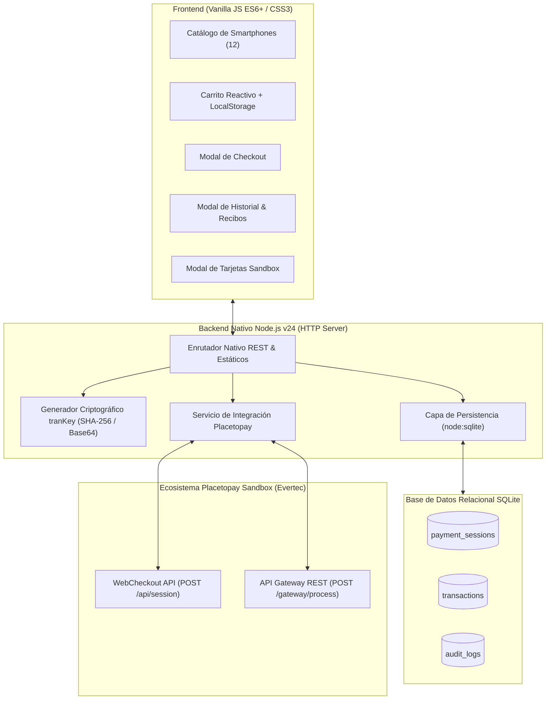

# Evertec PayShop — Integración Placetopay WebCheckout & API Gateway (SDD)

[](https://nodejs.org/)
[](https://pnpm.io/)
[](docs/sdd/)
[-003B57?logo=sqlite&logoColor=white)](src/database/)
[](https://www.w3.org/WAI/WCAG21/quickref/)
[](public/styles.css)

Proyecto de integración transaccional con la pasarela de pagos **Placetopay (Evertec)**, desarrollado como prueba técnica integral para el rol de **Analista de Implementaciones Nivel 1**.

Construido bajo la metodología **Spec-Driven Development (SDD)** inspirada en la cultura de ingeniería de **Anthropic**, ejecutado sobre el arnés **Antigravity** y diseñado con una arquitectura **Zero-Bloat** (cero dependencias externas en producción).

---

## 🚀 1. Inicio Rápido (Quick Start)

### Requisitos Previos
- **Node.js:** Versión `>= 20.0.0` (Recomendado: `Node.js v24.x LTS`).
- **PNPM:** Versión `>= 10.0.0` (**Prohibido el uso de `npm` o `yarn`**).

### Instalación y Ejecución
```bash
# 1. Clonar el repositorio
git clone <URL_REPOSITORIO>
cd "prueba tecnica"

# 2. Instalar dependencias con pnpm (sujeto a cuarentena de 48h de seguridad)
pnpm install

# 3. Iniciar el servidor local
pnpm start
```

El servidor web nativo estará disponible de inmediato en:
👉 **`http://localhost:3000`** (o `http://127.0.0.1:3000`).

---

## 🛒 2. Experiencia de Usuario y Flujo de Compra (Evertec PayShop)

La tienda virtual **Evertec PayShop** modela la venta de **12 smartphones de alta gama** con precios reales de mercado colombiano en COP, fotografías reales y especificaciones técnicas:

1. **Selección de Productos y Carrito Reactivo:**
   - Visualización uniforme en grid responsivo sin desbordes.
   - Drawer lateral accesible con conteo en tiempo real, cálculo de subtotales, IVA (19%) y total en COP.
   - **Regla de Negocio:** El botón de pago se encuentra deshabilitado si el carrito está vacío.
2. **Modal de Checkout Accesible:**
   - Al pulsar *"Ir a Pagar"*, se despliega el modal flotante (`#checkout-modal`) para capturar los datos esenciales del comprador (Nombre, Documento, Email, Teléfono celular y Dirección física).
   - El canal de pago es **100% WebCheckout transparente** por debajo (sin selectores confusos ni manipulación de tarjetas en el navegador).
3. **Redirección Bancaria Segura:**
   - Al confirmar el pedido, el backend calcula la firma criptográfica `tranKey` y genera la sesión en el sandbox de Placetopay (`POST /api/session`), transfiriendo inmediatamente al pagador a `processUrl`.
   - El carrito de compras se vacía automáticamente (`cart.clearCart()`) para un nuevo ciclo limpio.
4. **Retorno Parametrizado y Sincronización Automática:**
   - La pasarela redirige al cliente a `http://localhost:3000/?status=return&reference=...`.
   - El frontend detecta el retorno, limpia el carrito y dispara la consulta de actualización (`/api/checkout/status/:requestId`).
   - SQLite actualiza la transacción en tiempo real a su estado definitivo (`APPROVED`, `REJECTED`, etc.), registrando el **Código de Autorización** bancario y el **Número de Recibo**.
5. **Historial de Pagos y Recibo Detallado:**
   - Modal de auditoría (`#history-modal`) con tabla simplificada de 6 columnas y botón **"Ver Detalle"**.
   - Despliegue de recibo oficial con los datos completos del comprador, dirección y fecha/hora exacta en la zona horaria colombiana (**`America/Bogota` UTC-5**).

---

## 💳 3. Matriz de Tarjetas de Prueba Sandbox (Placetopay)

Para realizar pruebas en el entorno de evaluación, utiliza las siguientes tarjetas documentadas oficialmente por Placetopay:

| Franquicia | Número de Tarjeta | Exp / CVV | Estado Esperado | Razón / Código | Comportamiento en Sandbox |
| :--- | :--- | :--- | :--- | :--- | :--- |
| **Visa** | `4111 1111 1111 1111` | 12/28 / 123 | **APPROVED** | `00` / OK | Aprobación inmediata (Frictionless / Sin reto 3DS). Flujo exitoso estándar. |
| **Visa** | `4110 7600 0000 0081` | 12/28 / 123 | **APPROVED** | `00` / OK | Aprobación estándar directa en Sandbox. |
| **Mastercard** | `5180 3000 0000 0005` | 12/28 / 123 | **APPROVED** | `00` / OK | Aprobación exitosa para franquicia Mastercard. |
| **American Express** | `3435 7754 9670 001` | 12/28 / 1234 | **APPROVED** | `00` / OK | Aprobación exitosa para franquicia Amex (CVV de 4 dígitos). |
| **Diners Club** | `3654 5400 0000 08` | 12/28 / 123 | **APPROVED** | `00` / OK | Aprobación exitosa para franquicia Diners Club. |
| **Visa (Rechazada)** | `4110 7600 0000 0016` | 12/28 / 123 | **REJECTED** | Denegada (`05`) | Rechazo general por política bancaria del emisor. |
| **Visa (Rechazada)** | `4110 7600 0000 0073` | 12/28 / 123 | **REJECTED** | Denegada | Simula tarjeta declinada por la entidad financiera. |
| **Mastercard (Rechazada)** | `5180 3000 0000 0062` | 12/28 / 123 | **REJECTED** | Denegada | Declinación para franquicia Mastercard. |
| **Diners (Rechazada)** | `3654 5400 0000 248` | 12/28 / 123 | **REJECTED** | Denegada | Declinación para franquicia Diners Club. |
| **Fondos Insuficientes** | Monto que gatilla `XA` / `51` | 12/28 / 123 | **REJECTED** | Fondos Insuficientes (`XA`) | Rechazo financiero por fondos no disponibles o cupo excedido. |
| **Pendiente** | `4048 3700 0000 0037` | 12/28 / 123 | **PENDING** $\rightarrow$ **REJECTED** | En Proceso | Simula transacción que entra en estado pendiente y se resuelve asíncronamente. |
| **Visa 3DS (Challenge)** | `4111 1111 1111 1111` (con 3DS) | 12/28 / 123 | **CHALLENGE** | Reto 3DS (`C`) | Abre reto de autenticación bancaria. Ingresar código OTP: **`12345`**. |

> [!TIP]
> En la barra superior de la tienda encontrarás el botón **"💳 Tarjetas Sandbox"**, el cual abre un modal interactivo donde puedes copiar cualquiera de estas tarjetas con un solo clic.

---

## 🏛️ 4. Arquitectura y Stack Tecnológico (Zero-Bloat)



### Componentes Principales:
- **Runtime:** Node.js v24 nativo, aprovechando `node:sqlite` (`DatabaseSync`) y `node:crypto`. Cero dependencias npm en producción.
- **Base de Datos SQLite:** Archivo [`data/placetopay.db`](file:///C:/Users/USUARIO/prueba%20tecnica/data/placetopay.db) con llaves foráneas y deserialización defensiva de payloads.
- **Seguridad Criptográfica:** Algoritmo oficial de autenticación:
  $$\text{tranKey} = \text{Base64}\left(\text{SHA-256}\left(\text{rawNonce} + \text{seed} + \text{secretKey}\right)\right)$$
- **Credenciales Sandbox Configuradas:**
  - Login: `2d9eaf1e662518756a3d78806543af5b`
  - SecretKey: `3YC5brb5eAR4xBGQ`
  - WebCheckout URL: `https://checkout-test.placetopay.com/`
  - API Gateway URL: `https://api-test.placetopay.com/rest`

---

## 🛡️ 5. Gobernanza SDD y Guardrails Inmutables

El repositorio se rige bajo la metodología **Spec-Driven Development (Anthropic SDD)**. Cada funcionalidad atraviesa rigurosamente el ciclo:
$$\text{Intent (00)} \longrightarrow \text{Spec (01)} \longrightarrow \text{Plan (02)} \longrightarrow \text{Agentest (03)} \longrightarrow \text{Entrega (04)}$$

| Guardrail | Descripción |
| :--- | :--- |
| **G-01 (PNPM Exclusivo)** | Prohibición absoluta de `npm` o `yarn`. Intercepción estricta vía hook `preinstall`. |
| **G-02 (Cuarentena 48h)** | `minimum-release-age=2880` en `.npmrc` y `pnpm-workspace.yaml`. Previene ataques a la cadena de suministro. |
| **G-03 (No Code Without Spec)** | Ninguna línea de código se escribe sin especificación previa en `docs/sdd/01-specs/`. |
| **G-04 (Protocolo de Entrega)** | Prohibido crear actas en `04-entregas/` sin el 100% de tests de Agentest aprobados. |
| **G-05 (Trazabilidad)** | Bitácoras vivas en [`DEUDAS_TECNICAS.md`](DEUDAS_TECNICAS.md) y [`LECCIONES_APRENDIDAS.md`](LECCIONES_APRENDIDAS.md). |
| **G-06 (Ramas por Spec & Merge Humano)** | Trabajo aislado en ramas `feat/spec-XXX-*`. Merge a `main` condicionado a aprobación humana. |
| **G-07 (Prohibición de `git add .`)** | Staging explícito y atómico archivo por archivo. Prohibido el commit indiscriminado. |

---

## 🧪 6. Suites de Pruebas Automatizadas

El proyecto cuenta con un robusto catálogo de pruebas automatizadas:

```bash
# Ejecutar verificación de guardrails de seguridad y SDD
pnpm run verify:guardrails

# Ejecutar auditoría de Git (aislamiento de ramas y prohibición de git add .)
pnpm run verify:git

# Ejecutar suite de contratos Placetopay y persistencia SQLite (Spec-03)
pnpm run test:spec3

# Ejecutar suite de sincronización de estado, recibo y UI (Spec-06)
pnpm run test:spec6

# Ejecutar suite de documentación, tarjetas y soporte (Spec-07)
pnpm run test:spec7

# Ejecutar suite global de aceptación
pnpm test
```

---

## 📚 7. Documentación Adicional de la Prueba Técnica

Para la evaluación conceptual y de gestión de clientes, consulte el documento maestro:
👉 **[`docs/soporte/respuestas-conceptuales-y-casos.md`](docs/soporte/respuestas-conceptuales-y-casos.md)**

Contenido del documento:
1. **Respuestas Conceptuales Exhaustivas (Preguntas 1 a 7):**
   - RequestId (definición, utilidad e idempotencia).
   - Estados transaccionales (APPROVED, PENDING, REJECTED, FAILED).
   - Preautorizaciones (Holds) con ejemplo en Rent-a-car.
   - Cobro por suscripción vs recurrencia.
   - API Gateway vs WebCheckout (PCI compliance, UX y control).
   - Dispersión de fondos (Split payments en marketplaces).
   - Notificaciones asíncronas (Webhooks y firmas criptográficas).
2. **Gestión y Respuestas a los 4 Casos de Soporte:**
   - **Caso 1:** Error 102 Autenticación fallida en cliente crítico (riesgo churn).
   - **Caso 2:** Comercio CLARO con Error "Autenticación mal formada".
   - **Caso 3:** Comercio Sunshine — Confusión pedagógica y adopción de nuevas metodologías.
   - **Caso 4:** Comercio Sunshine — Escalamiento hostil, quejas de incompetencia y amenaza de cancelación.
3. **Diagramas de Secuencia Mermaid:** Flujos completos de interacción transaccional.

---

*Desarrollado con excelencia técnica por un candidato a Analista de Implementaciones Nivel 1 en Placetopay / Evertec.*
