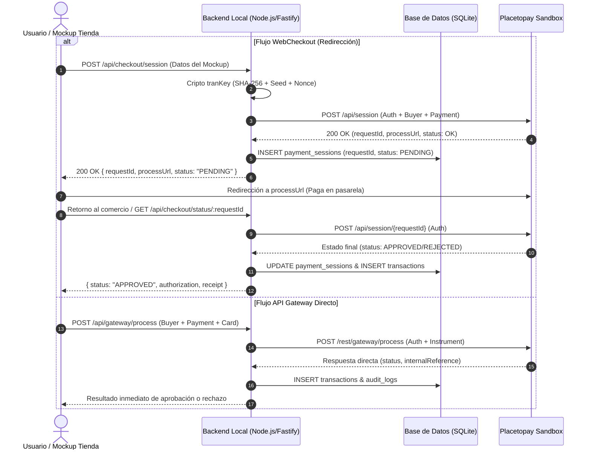

# Spec 03: Especificación Formal de Arquitectura Backend, Diccionario de Datos para Mockup MVP y Persistencia SQLite

- **Versión:** 1.0.0
- **Estado:** Activo / En Especificación
- **Autor:** SDD-Architect & Integration-Engineer
- **Revisor:** Usuario / Evertec Placetopay Evaluation
- **Intent Asociado:** [`docs/sdd/00-intents/003-intent-contratos-backend-y-mockup.md`](file:///C:/Users/USUARIO/prueba%20tecnica/docs/sdd/00-intents/003-intent-contratos-backend-y-mockup.md)

---

## 1. Diccionario de Datos para el Mockup y Formulario de Pago (MVP)

Para que el frontend/mockup del carrito de compras interactúe con fidelidad frente a la pasarela Placetopay, se define la siguiente estructura de campos normalizados:

### 1.1. Información del Comprador (`buyer`)
| Campo | Tipo | Obligatorio | Validación / Formato | Descripción |
| :--- | :--- | :--- | :--- | :--- |
| `name` | String | **Sí** | 2 a 80 caracteres. | Nombre del pagador. |
| `surname` | String | **Sí** | 2 a 80 caracteres. | Apellido del pagador. |
| `email` | String | **Sí** | Formato RFC 5322 (email). | Correo electrónico para notificación de pago. |
| `documentType`| Enum | **Sí** | `CC`, `CE`, `TI`, `NIT`, `PPN`, `RUT`. | Tipo de documento de identidad. |
| `document` | String | **Sí** | 5 a 20 caracteres numéricos/alfanuméricos. | Número de identificación del pagador. |
| `mobile` | String | **Sí** | 10 dígitos (ej. `3001234567`). | Teléfono móvil de contacto. |
| `street` | String | No | Máx. 100 caracteres. | Dirección de residencia o facturación. |
| `city` | String | No | Máx. 50 caracteres (ej. `Bogotá`, `Medellín`). | Ciudad del comprador. |
| `country` | String | No | ISO 3166-1 alpha-2 (Default `CO`). | País del pagador. |

### 1.2. Información de la Orden y Pago (`payment`)
| Campo | Tipo | Obligatorio | Validación / Formato | Descripción |
| :--- | :--- | :--- | :--- | :--- |
| `reference` | String | **Sí** | Única por orden (ej. `ORD-2026-1001-XXXX`). | Identificador interno de compra del comercio. |
| `description` | String | **Sí** | Máx. 250 caracteres. | Concepto del cobro visible para el cliente. |
| `currency` | Enum | **Sí** | `COP`, `USD`. (Default: `COP`). | Código ISO 4217 de la moneda. |
| `total` | Number | **Sí** | Mayor a 0 (ej. `50000` o `125000.00`). | Monto total a cobrar. |
| `items` | Array | No | Colección de objetos `{ sku, name, qty, price }`. | Desglose de productos seleccionados en el carrito. |

### 1.3. Selección de Modalidad Transaccional
| Campo | Tipo | Obligatorio | Valores Permitidos | Descripción |
| :--- | :--- | :--- | :--- | :--- |
| `channel` | Enum | **Sí** | `WEBCHECKOUT`, `GATEWAY_DIRECT` | Determina el flujo: redirección alojada o cobro directo. |

### 1.4. Datos Adicionales para `GATEWAY_DIRECT` (Tarjeta Directa)
| Campo | Tipo | Obligatorio | Formato | Descripción |
| :--- | :--- | :--- | :--- | :--- |
| `cardNumber` | String | Sí (en Gateway) | 15 o 16 dígitos sin espacios. | Número de tarjeta de crédito/débito. |
| `expMonth` | String | Sí (en Gateway) | 2 dígitos (`01` a `12`). | Mes de vencimiento. |
| `expYear` | String | Sí (en Gateway) | 2 o 4 dígitos (`26` a `35`). | Año de vencimiento. |
| `cvv` | String | Sí (en Gateway) | 3 o 4 dígitos. | Código valor de verificación (CVV/CVC). |
| `installments`| Number | Sí (en Gateway) | Entero entre 1 y 36. | Número de cuotas diferidas. |

---

## 2. Contratos de la API del Backend (Servicio Transaccional)



### 2.1. `POST /api/checkout/session`
- **Propósito:** Iniciar una sesión en WebCheckout y entregar al mockup la URL de pago.
- **Request Body (JSON):**
  ```json
  {
    "buyer": {
      "name": "Juan",
      "surname": "Perez",
      "email": "juan.perez@example.com",
      "documentType": "CC",
      "document": "1020304050",
      "mobile": "3001234567",
      "street": "Calle 100 # 15-20",
      "city": "Bogotá"
    },
    "payment": {
      "reference": "ORD-20261001-9872",
      "description": "Compra Carrito MVP - Prueba Tecnica",
      "amount": { "currency": "COP", "total": 85000 }
    },
    "returnUrl": "http://localhost:3000/response"
  }
  ```
- **Response Exitosa (200 OK):**
  ```json
  {
    "success": true,
    "requestId": 3875385,
    "processUrl": "https://checkout-test.placetopay.com/spa/session/3875385/372447527e3c5fdb6288f1eb4d2384c8",
    "reference": "ORD-20261001-9872",
    "status": "PENDING"
  }
  ```

### 2.2. `GET /api/checkout/status/:requestId`
- **Propósito:** Consultar el estado de una sesión WebCheckout tras el retorno del pagador.
- **Response (200 OK):**
  ```json
  {
    "requestId": 3875385,
    "reference": "ORD-20261001-9872",
    "status": "APPROVED",
    "statusReason": "00",
    "statusMessage": "Aprobada",
    "date": "2026-10-01T21:15:10-05:00",
    "payment": {
      "authorization": "123456",
      "receipt": "987654321",
      "amount": { "currency": "COP", "total": 85000 },
      "issuerName": "BANCO DE PRUEBA",
      "paymentMethod": "visa"
    }
  }
  ```

### 2.3. `GET /api/transactions/evidences`
- **Propósito:** Retornar todas las transacciones persistidas en SQLite agrupadas por estado (**APROBADO**, **PENDIENTE**, **RECHAZADO**) para exportar las evidencias solicitadas en la prueba técnica.

---

## 3. Modelo Relacional en SQLite (DDL)

Se definen 3 tablas relacionales con persistencia local en `data/placetopay.db`:

```sql
-- 1. Tabla de Sesiones de Pago (WebCheckout)
CREATE TABLE IF NOT EXISTS payment_sessions (
    id INTEGER PRIMARY KEY AUTOINCREMENT,
    request_id INTEGER UNIQUE NOT NULL,
    reference VARCHAR(80) NOT NULL,
    description TEXT,
    amount REAL NOT NULL,
    currency VARCHAR(3) NOT NULL DEFAULT 'COP',
    buyer_name VARCHAR(160) NOT NULL,
    buyer_email VARCHAR(120) NOT NULL,
    buyer_document VARCHAR(30) NOT NULL,
    process_url TEXT NOT NULL,
    status VARCHAR(20) NOT NULL DEFAULT 'PENDING',
    status_reason VARCHAR(10),
    status_message TEXT,
    raw_response TEXT,
    created_at DATETIME DEFAULT CURRENT_TIMESTAMP,
    updated_at DATETIME DEFAULT CURRENT_TIMESTAMP
);

-- 2. Tabla de Transacciones Procesadas (WebCheckout y API Gateway)
CREATE TABLE IF NOT EXISTS transactions (
    id INTEGER PRIMARY KEY AUTOINCREMENT,
    session_id INTEGER,
    channel VARCHAR(20) NOT NULL, -- 'WEBCHECKOUT' o 'GATEWAY'
    reference VARCHAR(80) NOT NULL,
    internal_reference VARCHAR(50),
    authorization_code VARCHAR(30),
    receipt VARCHAR(50),
    status VARCHAR(20) NOT NULL, -- 'APPROVED', 'PENDING', 'REJECTED', 'FAILED'
    status_reason VARCHAR(10),
    status_message TEXT,
    payment_method VARCHAR(50),
    amount REAL NOT NULL,
    currency VARCHAR(3) NOT NULL DEFAULT 'COP',
    raw_payload TEXT,
    created_at DATETIME DEFAULT CURRENT_TIMESTAMP,
    FOREIGN KEY(session_id) REFERENCES payment_sessions(id)
);

-- 3. Tabla de Auditoría de Peticiones a Placetopay
CREATE TABLE IF NOT EXISTS audit_logs (
    id INTEGER PRIMARY KEY AUTOINCREMENT,
    service_type VARCHAR(20) NOT NULL, -- 'WEBCHECKOUT_SESSION', 'WEBCHECKOUT_QUERY', 'GATEWAY_PROCESS'
    endpoint TEXT NOT NULL,
    http_method VARCHAR(10) NOT NULL,
    request_payload TEXT,
    response_payload TEXT,
    http_status INTEGER,
    latency_ms INTEGER,
    created_at DATETIME DEFAULT CURRENT_TIMESTAMP
);
```

---

## 4. Estrategia de Demostración de Evidencias y Estados Transaccionales

La prueba técnica exige evidenciar el flujo transaccional en sus tres resultados finales:
1. **PENDIENTE (`PENDING`):**
   - Estado natural tras la creación de sesión con `POST /api/session`. La pasarela responde `status.status = "OK"` y la sesión queda en `PENDING` (`reason: "PC"`, *"La petición se encuentra activa"*) hasta que el pagador interactúe o culmine el pago asíncrono.
2. **APROBADO (`APPROVED`):**
   - Transacción completada satisfactoriamente (`reason: "00"`). Se captura y persiste el número de recibo (`receipt`), código de autorización bancaria (`authorization`), franquicia y fecha/hora.
3. **RECHAZADO (`REJECTED` / `FAILED`):**
   - Declinación de la transacción. A continuación se desglosa la matriz exhaustiva de tipologías y causas reales de rechazo.

---

## 5. Matriz Exhaustiva de Motivos de Rechazo (Placetopay / Evertec)

Un rechazo transaccional nunca es genérico; responde a causales bancarias, de riesgo, de usuario o técnicas:

| Categoría | Código Reason | Mensaje / Causa | Origen | Acción Sugerida al Comercio / Pagador |
| :--- | :--- | :--- | :--- | :--- |
| **Banco Emisor** | `05` / `51` / `RM` | Fondos insuficientes / Límite de cupo excedido | Entidad Financiera | Invitar al usuario a consultar su saldo o utilizar otro medio de pago. |
| **Banco Emisor** | `14` / `54` | Tarjeta vencida / Fecha de expiración inválida | Franquicia / Emisor | Solicitar al usuario verificar el mes/año de vencimiento o renovar el plástico. |
| **Banco Emisor** | `55` / `82` | CVV / CVC inválido o PIN erróneo | Validación Criptográfica | Solicitar verificar el código de 3 o 4 dígitos al reverso de la tarjeta. |
| **Banco Emisor** | `12` / `57` | Transacción no permitida a la tarjeta / e-commerce bloqueado | Banco Emisor | Indicar al cliente que comunique con su banco para habilitar compras por internet. |
| **Banco Emisor** | `04` / `41` / `43` | Tarjeta reportada como extraviada, robada o bloqueada | Red de Pagos / Emisor | Bloquear la operación; tarjeta retenida por protocolo de seguridad. |
| **Banco Emisor** | `61` | Excede el monto límite permitido por operación | Banco Emisor | Recomendar realizar el pago en montos fraccionados o elevar cupo con el banco. |
| **Usuario** | `?C` | Proceso cancelado voluntariamente por el pagador | WebCheckout UI | El usuario pulsó "Cancelar y volver al comercio"; registrar abandono y ofrecer retomar compra. |
| **Usuario** | `EX` | Sesión expirada por inactividad | Time-to-Live (TTL) | El usuario superó el tiempo de vigencia de la sesión (`expiration`); generar nueva sesión. |
| **Riesgo / Antifraude** | `AF` / `RISK` | Declinada por motor de prevención de fraude | Cybersource / RedShield | Parámetros anómalos (IP en lista negra, geolocalización inconsistente, alta velocidad de intentos). |
| **Conectividad / Red** | `91` / `TO` / `XN` | Time-out bancario / Entidad financiera no disponible | Adquirente / Red | Problemas de comunicación transitoria; sugerir reintentar en unos minutos. |
| **Técnico / Integración**| `102` | Autenticación fallida | Gateway Placetopay | Desincronización horaria en `seed`, `secretKey` errónea o firma `tranKey` mal calculada. |
| **Técnico / Integración**| `100` | Autenticación mal formada | Validación de API | Objeto `auth` incompleto, `nonce` corrupto o tipos de datos alterados. |
| **Técnico / Negocio** | `BR` | Solicitud inválida / Regla de negocio no satisfecha | Validación Gateway | Faltan campos mandatorios del comprador o moneda no soportada por el comercio. |

---

## 6. Criterios de Aceptación (AC)

- **AC-3.1:** El diccionario de datos describe con exactitud campos, tipos y validaciones del mockup.
- **AC-3.2:** Los endpoints `/api/checkout/session`, `/api/checkout/status/:requestId` y `/api/transactions/evidences` quedan formalmente especificados.
- **AC-3.3:** El esquema relacional SQLite (`payment_sessions`, `transactions`, `audit_logs`) está completamente diseñado para soportar auditoría y los 3 estados.
- **AC-3.4:** Se documenta la Matriz Exhaustiva de Motivos de Rechazo detallando causas bancarias, de usuario, antifraude y técnicas.
- **AC-3.5:** La suite de pruebas de Agentest 003 verifica los modelos, la generación de firmas de autenticación y la persistencia de los múltiples motivos de rechazo.
