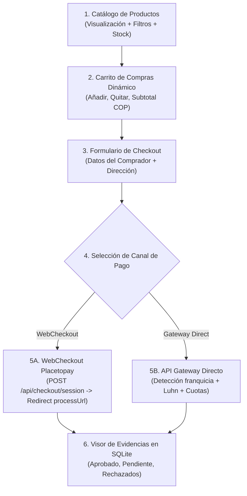

# Spec 004: Mockup Frontend E-Commerce, Design System Evertec, A11y WCAG 2.1 AA, SEO y Performance

- **Fase SDD:** 01-Spec
- **Autor / Rol:** SDD-Architect & Frontend-UX-Architect
- **Fecha:** 2026-10-01
- **Rama:** `feat/spec-004-mockup-frontend-evertec`
- **Estado:** Especificación Viva Aprobada

---

## 1. Design System Corporativo Evertec

El mockup frontend adoptará una identidad visual moderna inspirada en las líneas corporativas y la campaña *"Orange Revolution"* de **Evertec**:

```
+-----------------------------------------------------------------------------------+
|  #0B192C (Azul Marino Corporativo) - Headers, Navbar, Fondos Institucionales      |
|  #FF5900 (Naranja Evertec) - Acentos, Botones de Acción Primaria, Badges          |
|  #0077CC (Azul Acento / Enlaces) - Links activos, focos de accesibilidad         |
|  #F8FAFC (Superficie Clara) - Fondo general de tienda y tarjetas limpias          |
|  #0F172A (Slate 900) - Tipografía de alto contraste (Ratio 14.8:1 WCAG AAA)     |
+-----------------------------------------------------------------------------------+
```

### 1.1. Tokens de Color CSS
```css
:root {
  --color-primary: #FF5900;          /* Naranja Evertec */
  --color-primary-hover: #E04E00;    /* Naranja Hover Oscurecido */
  --color-primary-accessible: #D44A00; /* Naranja 4.65:1 para fondos blancos */
  --color-navy: #0B192C;             /* Azul Marino Evertec */
  --color-navy-light: #1E293B;       /* Marino Secundario */
  --color-accent-blue: #0077CC;      /* Azul Acento Interactivo */
  --color-bg-page: #F8FAFC;          /* Fondo Claro */
  --color-bg-card: #FFFFFF;          /* Fondo Blanco Tarjeta */
  --color-border: #E2E8F0;           /* Bordes Suaves */
  --color-text-main: #0F172A;        /* Slate 900 - Contraste 14.8:1 */
  --color-text-muted: #475569;       /* Slate 600 - Contraste 7.1:1 */
  --color-success: #166534;          /* Verde Aprobado (WCAG AAA) */
  --color-success-bg: #DCFCE7;
  --color-warning: #854D0E;          /* Ámbar Pendiente (WCAG AAA) */
  --color-warning-bg: #FEF9C3;
  --color-danger: #991B1B;           /* Rojo Rechazado (WCAG AAA) */
  --color-danger-bg: #FEE2E2;
  --focus-ring: 0 0 0 3px rgba(0, 119, 204, 0.45);
}
```

---

## 2. Especificación de Accesibilidad Universal (WCAG 2.1 AA)

1. **Ratios de Contraste Certificados:**
   - Textos normales: mínimo 4.5:1 contra sus respectivos fondos.
   - Textos grandes (>18px o bold >14px) e iconos activos: mínimo 3.0:1.
2. **Navegabilidad por Teclado:**
   - Enlace de salto invisible para saltar navegación (`.skip-link`).
   - Todos los elementos interactivos (`<button>`, `<input>`, `<select>`, `<a>`) son alcanzables vía `Tab` / `Shift+Tab`.
   - Indicador de foco visible de alto contraste (`:focus-visible`) en todos los controles.
3. **Semántica y Tecnologías de Asistencia (Screen Readers):**
   - Regiones estructurales con ARIA landmarks: `<header role="banner">`, `<main id="content">`, `<nav aria-label="Navegación de la tienda">`, `<aside aria-label="Carrito de compras">`, `<footer role="contentinfo">`.
   - Campos de formulario con `<label for="...">` explícitos y `aria-required="true"`.
   - Modales accesibles con `role="dialog"`, `aria-modal="true"` y trampeo de foco accesible.
   - Actualizaciones de precio y estado mediante `aria-live="polite"`.

---

## 3. Especificación SEO On-Page y Datos Estructurados

1. **Jerarquía Semántica:**
   - `<h1>` único descriptivo: *"Evertec PayShop — Demostración de Integración Placetopay"*.
   - `<h2>` por sección: *"Catálogo de Productos"*, *"Resumen del Carrito"*, *"Datos del Comprador y Pasarela"*, *"Historial y Evidencias de Transacciones"*.
2. **Metadatos y Redes Sociales:**
   - `<meta name="description">` de 145 caracteres con keywords transaccionales.
   - Etiquetas OpenGraph (`og:title`, `og:description`, `og:image`, `og:url`, `og:type="website"`).
   - Twitter Cards (`twitter:card="summary_large_image"`).
3. **Marcado JSON-LD Schema.org:**
   ```json
   {
     "@context": "https://schema.org",
     "@graph": [
       {
         "@type": "Organization",
         "name": "Evertec / Placetopay",
         "url": "https://www.evertecinc.com"
       },
       {
         "@type": "ItemList",
         "name": "Catálogo de Productos Tecnológicos Evertec",
         "itemListElement": [...]
       }
     ]
   }
   ```

---

## 4. Arquitectura de Componentes UI/UX y Flujo de Compra



### 4.1. Catálogo de Productos del MVP
Para la prueba técnica se modelan productos tecnológicos representativos:
1. **Terminal POS Evertec SmartPay:** $350.000 COP
2. **Lector de Tarjetas Mobile Evertec PinPad:** $180.000 COP
3. **Gateway E-Commerce Token Pro (Suscripción Anual):** $520.000 COP
4. **Dispositivo Biométrico de Seguridad Financiera:** $290.000 COP

### 4.2. Formularios Guiados y Reactividad UI/UX
- **Detección Automática de Franquicia:** Al teclear los primeros 2-4 dígitos, se identifica Visa (`4`), Mastercard (`51-55` / `22-27`), American Express (`34`/`37`).
- **Validación Luhn en Tiempo Real:** Feedback cromático e icono de verificación inmediata.
- **Formateador de Expiración:** Inserción automática de barra inclinada (`MM/YY`).
- **Visor de Evidencias Integrado:** Tablero en vivo que consulta SQLite y muestra los últimos pagos en estado Aprobado, Pendiente y Rechazado con sus causales bancarias.

---

## 5. Criterios de Aceptación (AC)

- **AC-4.1:** El mockup visual aplica la paleta corporativa de Evertec (`#0B192C`, `#FF5900`, `#0077CC`).
- **AC-4.2:** La interfaz cumple con WCAG 2.1 AA (contrastes >= 4.5:1, etiquetas explícitas for=id, soporte de navegación por teclado).
- **AC-4.3:** El código HTML5 contiene metadatos OpenGraph, Twitter Cards y bloque JSON-LD Schema.org válido.
- **AC-4.4:** El carrito permite agregar/eliminar productos, recalcular subtotales en COP y persistir el estado.
- **AC-4.5:** El checkout implementa los 2 canales de Placetopay (WebCheckout y Gateway Direct) conectados con el backend y SQLite.
- **AC-4.6:** El tablero de evidencias lista los estados Aprobado, Pendiente y Rechazado demostrando la taxonomía de fallos.
- **AC-4.7:** La suite automatizada de Agentest 004 valida el 100% de los criterios antes de habilitar la compuerta de entrega.
