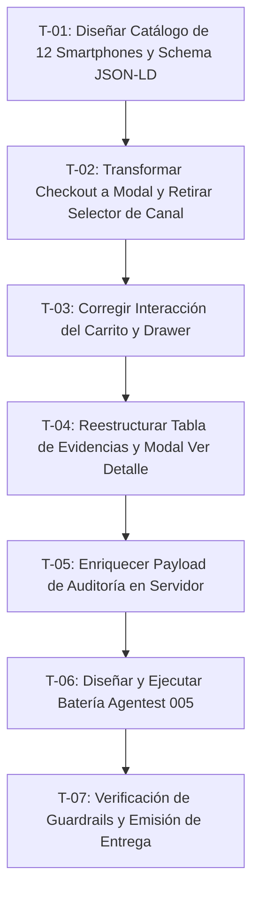

# Plan de Trabajo Técnico 005 — Tienda de Smartphones, Checkout Modal y Simplificación de Pasarela

## 1. Desglose de Tareas Atómicas

| ID Tarea | Responsable | Descripción de la Actividad | Artefactos Afectados |
| :--- | :--- | :--- | :--- |
| **T-01** | `Frontend-UX-Architect` | Crear el catálogo de 12 smartphones con precios reales de Colombia, SKUs, iconos e integrarlos en `PRODUCTS` y Schema.org JSON-LD. | `public/app.js`, `public/index.html` |
| **T-02** | `Frontend-UX-Architect` | Convertir `#checkout-section` en un modal flotante accesible `#checkout-modal`, eliminando selector de canal y campos de tarjeta. | `public/index.html`, `public/styles.css` |
| **T-03** | `Frontend-UX-Architect` | Ajustar eventos y CSS de `#cart-toggle-btn` y vincular el botón "Ir a Pagar" para abrir `#checkout-modal`. | `public/app.js`, `public/styles.css` |
| **T-04** | `Frontend-UX-Architect` | Limpiar columnas `Canal` y `Razón` de la tabla de evidencias. Implementar botón "Ver Detalle" y modal `#detail-modal`. | `public/index.html`, `public/app.js`, `public/styles.css` |
| **T-05** | `Integration-Engineer` | Asegurar que `/api/checkout/session` almacene información del pagador y de la orden en `rawPayload` para el visor de detalles. | `src/server.js` |
| **T-06** | `Quality-Agentester` | Construir `scripts/test-smartphones-checkout.mjs` con 10 pruebas exhaustivas de aceptación y ejecutarlas. | `scripts/test-smartphones-checkout.mjs`, `package.json` |
| **T-07** | `Quality-Agentester` & `Git-Workflow-Guardian` | Validar guardrails, registrar deudas/lecciones aprendidas y redactar el acta de entrega condicional. | `DEUDAS_TECNICAS.md`, `LECCIONES_APRENDIDAS.md`, `04-entregas/` |

---

## 2. Gestión de Riesgos y Mitigaciones
- **Riesgo 1: Regresión en tests previos de Spec-04.**
  - *Mitigación:* Los tests de Spec-04 verificaban la existencia de ciertos campos y la rama `feat/spec-004-*`. Mantendremos una suite especializada `Agentest-005` dedicada a los nuevos requerimientos y mantendremos la compatibilidad de contratos en el validador.
- **Riesgo 2: Bloqueo de clics por superposición de modales o drawer.**
  - *Mitigación:* Regla CSS estricta: sólo un modal/drawer abierto a la vez. Al abrir el modal de checkout, se cierra automáticamente el drawer del carrito. Todos los overlays usan `display: none` cuando están `hidden`.

---

## 3. Definición de Hecho (DoD - Definition of Done)
1. 12 smartphones de alta gama listados en catálogo con precios reales en COP.
2. Botón del carrito responde inmediatamente y abre el drawer.
3. Botón "Ir a Pagar" abre el modal de checkout sin scroll molesto.
4. No existe selección de canal ni campos de tarjeta en la UI; el flujo es WebCheckout 100% transparente.
5. Tabla de evidencias con 6 columnas limpias (sin Canal ni Razón) y botón "Ver Detalle".
6. Modal de detalle amigable con datos de compra y datos técnicos en acordeón.
7. Suite de pruebas Agentest 005 aprobada al 100% (10/10 PASS).
8. Guardrails y trazabilidad Git verificados sin infracciones.
