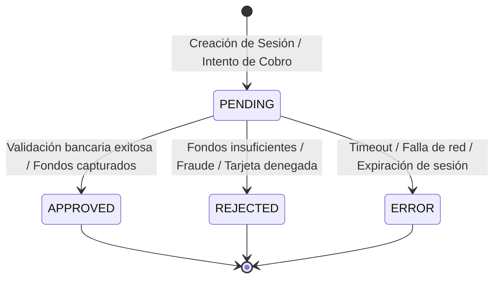
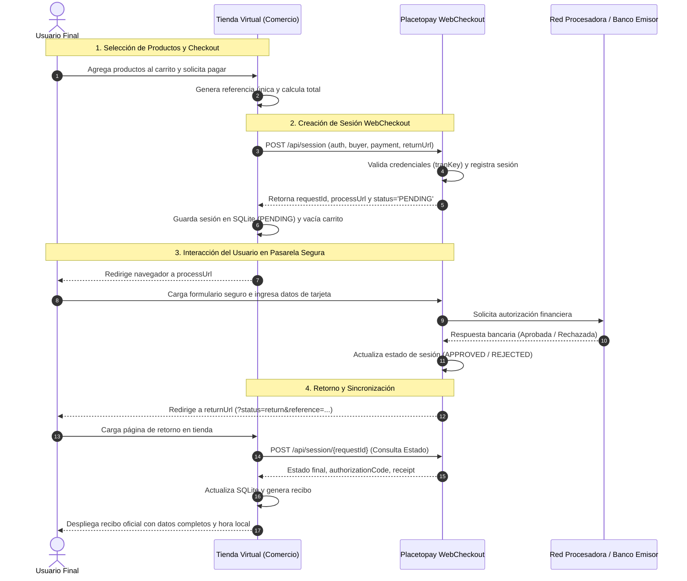
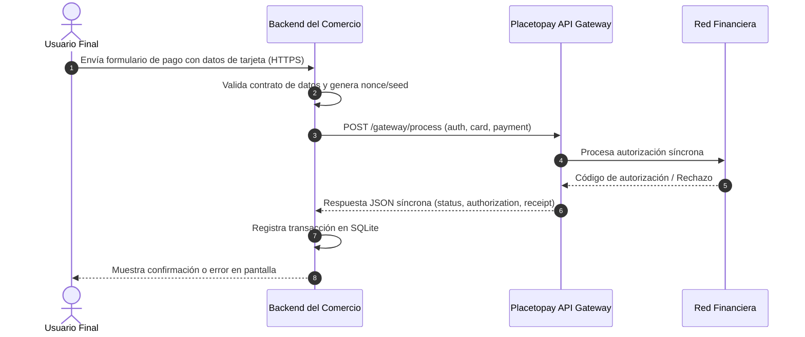

# Respuestas Conceptuales, Casos de Soporte y Diagramas de Integración Placetopay

**Rol:** Analista de Implementaciones Nivel 1 (Placetopay / Evertec)  
**Proyecto:** Integración WebCheckout y API Gateway con metodología SDD (Anthropic)  
**Fecha:** 2026-10-02  
**Autor:** Evertec / Placetopay Candidate  

---

## 1. Respuestas a Preguntas Conceptuales

### Pregunta 1: ¿Qué es el RequestId, para qué sirve y en qué casos se repite?
- **Definición y Propósito:**
  El `requestId` es el identificador único numérico generado por Placetopay al crear una sesión de pago, Funciona como la clave primaria del lado de la pasarela para identificar unívocamente una intención de pago o sesión transaccional.
- **¿Para qué sirve?:**
  1. **Consulta de Estado (`Querying`):** Permite al comercio consultar el estado actual del proceso (`POST /api/session/{requestId}`) para saber si el usuario completó el pago, lo canceló o sigue en trámite.
  2. **Trazabilidad y Conciliación:** Es el identificador correlativo con el que los equipos de soporte técnico, conciliación bancaria y auditoría rastrean el ciclo de vida de la transacción en los registros de Placetopay.
  3. **Manejo de Notificaciones (Webhooks):** Placetopay envía el `requestId` en el cuerpo del webhook de notificación para que el comercio identifique a qué sesión corresponde la actualización.
- **¿En qué casos se repite?:**
  - **Entre sesiones distintas:** **NUNCA se repite**. Cada llamado a `createSession` genera un nuevo `requestId` único incremental.
  - **Repetición intencional o accidental por el comercio:** Si el comercio intenta reutilizar un `requestId` ya procesado en llamadas de creación, Placetopay rechaza la solicitud garantizando **idempotencia**. El `requestId` solo se repite como referencia en peticiones subsiguientes de *consulta* (`POST /api/session/{requestId}`) o en notificaciones asíncronas para referirse a la misma transacción.

---

### Pregunta 2: ¿Cuáles son los estados de una transacción? Explica el significado de cada uno de ellos.
En el ecosistema Placetopay (WebCheckout y Gateway), las transacciones y sesiones transitan por los siguientes estados canónicos definidos en el objeto `status`:



1. **`APPROVED` (Aprobada / Estado `OK` o `00`):**
   - **Significado:** La transacción fue procesada y autorizada exitosamente por las redes procesadoras (franquicias) y el banco emisor. Los fondos han sido debitados (o autorizados) de la cuenta del tarjetahabiente y transferidos/abonados a la cuenta recaudadora del comercio.
   - **Campos asociados:** Retorna un `authorization` (código de autorización bancario) y un `receipt` (número de recibo/comprobante oficial).
2. **`PENDING` (Pendiente / Razón `PC`):**
   - **Significado:** La transacción se encuentra en espera de confirmación. Ocurre en dos escenarios:
     - En WebCheckout: La sesión fue creada y se encuentra activa a la espera de que el usuario final ingrese sus credenciales bancarias o complete el formulario.
     - En medios de pago asíncronos (PSE, transferencias bancarias, corresponsales bancarios como Efecty o Baloto): La solicitud fue enviada pero el banco o la entidad recaudadora no ha confirmado aún la liquidación del dinero.
   - **Acción requerida:** El comercio debe mantener el pedido en espera sin despachar y consultar el estado periódicamente o aguardar la notificación asíncrona (webhook).
3. **`REJECTED` (Rechazada / Razón `XA`, `51`, `05`, `91`, etc.):**
   - **Significado:** La transacción fue declinada por el banco emisor, por las redes financieras o por las reglas del motor anti-fraude de Placetopay.
   - **Causales comunes:** Fondos insuficientes (`XA` o causal `51`), tarjeta bloqueada/robada (`05`), CVV incorrecto, fecha de vencimiento errónea, límite diario superado o tarjeta no habilitada para compras internacionales por internet.
4. **`FAILED` / `ERROR`:**
   - **Significado:** No se pudo completar la comunicación transaccional debido a un fallo técnico, caída en la red del adquirente, indisponibilidad del switch bancario o expiración del tiempo límite de la sesión (`expiration` alcanzado sin interacción).
   - **Acción:** El comercio puede sugerir al usuario reintentar el pago o seleccionar un medio de pago alternativo.

---

### Pregunta 3: ¿Qué es una preautorización y cómo funcionaría para un comercio? Proporciona un ejemplo.
- **Concepto:**
  Una **preautorización** (o *Hold* de fondos) es una operación transaccional donde el comercio solicita al banco emisor verificar la validez de la tarjeta y **bloquear/reservar temporalmente** un monto específico del cupo del cliente, **sin realizar la captura ni el débito contable inmediato** del dinero. Posteriormente, el comercio puede ejecutar una operación de **Captura** (`Capture`) por el valor final real o una **Cancelación/Liberación** (`Void`/`Release`) si el servicio no se prestó.
- **Beneficio para el comercio:**
  Garantiza la disponibilidad de los fondos con antelación, eliminando el riesgo de "fondos insuficientes" al momento del cobro final, y evita cobros y reembolsos innecesarios si el importe final varía.
- **Ejemplo Práctico en la Industria: Empresa de Alquiler de Vehículos (Rent-A-Car):**
  1. **Check-in / Entrega del Vehículo:** Un cliente alquila un automóvil durante 3 días ($450.000 COP) y la empresa exige un depósito de garantía por daños o combustible de $1.000.000 COP. El comercio ejecuta una **preautorización** por $1.450.000 COP. El cupo del cliente queda retenido, pero no se ha facturado en su extracto bancario.
  2. **Uso del servicio:** El cliente utiliza el vehículo durante los 3 días convenidos.
  3. **Check-out / Devolución:** El cliente entrega el vehículo a tiempo, en perfecto estado y con el tanque de combustible lleno.
  4. **Captura Final:** El comercio ejecuta una solicitud de **Captura** únicamente por los $450.000 COP del alquiler efectivo y libera (`Void`) los $1.000.000 COP del depósito de garantía, restituyendo de inmediato el cupo disponible en la tarjeta del cliente.

---

### Pregunta 4: Explica las diferencias entre cobro por suscripción y cobro por recurrencia.

| Criterio | Cobro por Suscripción | Cobro por Recurrencia |
| :--- | :--- | :--- |
| **Definición** | Modelo de cobro periódico automático donde el valor y la frecuencia temporal son **fijos y predeterminados** contractualmente. | Modelo donde el comercio almacena de forma segura un token de pago del cliente para realizar cobros automáticos posteriores según el **consumo variable o demanda**. |
| **Monto Cobrado** | **Fijo e invariable** en cada ciclo de facturación (salvo previo aviso contractual). | **Variable o dinámico**, dependiendo de métricas de uso, consumo o compras adicionales. |
| **Periodicidad** | Calendarizada estrictamente (ej. mensual el día 1, trimestral, anual). | A demanda o por corte de consumo (ej. al finalizar un viaje, al superar un umbral de uso). |
| **Mecanismo Placetopay** | Se gestiona mediante el módulo de `Subscription` / planes automáticos en Placetopay. | Se gestiona mediante `Tokenización` (Token / Instrumento de pago registrado) invocado a demanda vía API Gateway. |
| **Ejemplos del Mundo Real** | - Planes de streaming (Netflix, Spotify).<br>- Gimnasio mensual ($90.000 COP fijos al mes).<br>- Licencia SaaS fija (Microsoft 365). | - Servicios públicos (electricidad/agua, donde el monto cambia según el consumo mensual).<br>- Aplicaciones de movilidad (Uber, DiDi, cobro según kilometraje).<br>- Servicios en la nube (AWS/Azure según horas de cómputo utilizadas). |

---

### Pregunta 5: ¿Cuál es la diferencia entre API Gateway y Webcheckout?

```mermaid
graph TD
    subgraph WebCheckout["Placetopay WebCheckout (Hosted)"]
        WC_User["Usuario en Tienda"] -->|Clic Pagar| WC_Redirect["Redirección a Placetopay"]
        WC_Redirect -->|Digita Tarjeta en Entorno Seguro Evertec| WC_P2P["Pasarela Placetopay (PCI DSS Nivel 1)"]
        WC_P2P -->|Retorno + Webhook| WC_Store["Tienda Virtual del Comercio"]
    end

    subgraph APIGateway["Placetopay API Gateway (Direct Rest)"]
        GW_User["Usuario en Tienda"] -->|Digita Tarjeta en Comercio| GW_Store["Backend del Comercio"]
        GW_Store -->|POST /gateway/process (JSON cifrado)| GW_P2P["API Gateway Placetopay"]
        GW_P2P -->|Respuesta JSON Síncrona| GW_Store
    end
```

| Característica | Placetopay WebCheckout | Placetopay API Gateway |
| :--- | :--- | :--- |
| **Tipo de Integración** | **Hosted Checkout (Redirección segura):** El cliente es transferido temporalmente a una página web segura administrada por Evertec/Placetopay. | **Direct Server-to-Server (REST API):** El cliente permanece en el sitio web o app nativa del comercio; los datos se capturan en el frontend y se envían vía API. |
| **Cumplimiento PCI-DSS** | **Mínimo (SAQ-A):** El comercio nunca toca, procesa ni almacena datos de tarjeta de crédito (PAN, CVV). Toda la responsabilidad de seguridad recae sobre la pasarela. | **Estricto (SAQ A-EP o SAQ D):** El comercio debe contar con certificación PCI-DSS de auditoría de redes y servidores, pues los datos sensibles transitan por su infraestructura. |
| **Experiencia de Usuario (UI/UX)** | Flujo estándar de pasarela bancaria. Puede personalizarse con logotipo corporativo y colores institucionales del comercio. | **White-label / 100% Personalizado:** El comercio diseña completamente la interfaz de pago, inputs y flujos en su aplicación nativa sin saltos de página. |
| **Medios de Pago Soportados** | Tarjetas de crédito/débito, PSE, billeteras digitales, efectivo (Efecty, Baloto), split de pagos, etc. | Principalmente tarjetas de crédito/débito tokenizadas y procesamiento transaccional directo. |
| **Esfuerzo de Implementación** | **Bajo / Rápido:** Basta con invocar `POST /api/session` y redirigir al pagador al `processUrl`. | **Medio / Alto:** Requiere implementar validaciones de tarjeta, cifrado de payload, manejo de errores detallado y tokenización. |

---

### Pregunta 6: ¿Para qué se usa la dispersión en un comercio?
- **Concepto y Utilidad:**
  La **dispersión de fondos** (también conocida como *Split Payment* o liquidación multipartes) es la funcionalidad que permite **fraccionar y distribuir automáticamente** el dinero recaudado en una única transacción de pago entre **dos o más cuentas bancarias beneficiarias** distintas, descontando comisiones de servicio e impuestos en el mismo instante de la liquidación.
- **Casos de Uso Principales:**
  1. **Marketplaces y Plataformas E-commerce:** Un usuario compra en una tienda digital un producto del Proveedor A ($100.000 COP) y otro del Proveedor B ($50.000 COP) en un solo carrito ($150.000 COP). Con dispersión, Placetopay abona $95.000 al Proveedor A, $47.500 al Proveedor B y retiene $7.500 de comisión para el dueño de la plataforma.
  2. **Apps de Economía Colaborativa / Domicilios:** Distribución automática del valor total entre el restaurante afiliado, el repartidor (propina y tarifa de entrega) y la plataforma tecnológica.
  3. **Comisiones de Franquicias y Agencias de Viajes:** Reparto inmediato entre la aerolínea, el hotel y la comisión de intermediación de la agencia.
- **Beneficio Operativo:** Elimina la carga administrativa de recibir todo el dinero en una sola cuenta y tener que realizar transferencias manuales posteriores, mitigando el impacto tributario de retenciones indebidas (como el gravamen a los movimientos financieros o retención en la fuente sobre ingresos de terceros).

---

### Pregunta 7: ¿Para qué sirve la notificación (Webhook)?
- **Concepto y Necesidad:**
  La **notificación** (o Webhook transaccional) es un mecanismo de comunicación asíncrono *Server-to-Server* mediante el cual Placetopay envía automáticamente una petición HTTP POST al servidor del comercio en el instante exacto en que una transacción cambia de estado (ej. de `PENDING` a `APPROVED` o `REJECTED`).
- **¿Para qué sirve?:**
  1. **Garantizar la actualización sin depender del navegador del usuario:** Si un comprador realiza el pago en WebCheckout pero inmediatamente cierra la pestaña, sufre una desconexión de internet o falla la redirección, el webhook garantiza que el servidor del comercio reciba la confirmación oficial.
  2. **Sincronización de Pagos Asíncronos (PSE y Efectivo):** En transacciones de PSE o puntos de recaudo en efectivo, la aprobación puede tardar minutos u horas. El webhook notifica al comercio en tiempo real en cuanto el banco emisor aprueba la transferencia, disparando el despacho del pedido o activación del servicio.
  3. **Seguridad y Validación Criptográfica:** El webhook incluye una firma de autenticación que el comercio debe verificar para tener certeza matemática de que la notificación proviene legítimamente de Evertec/Placetopay y no de un tercero malicioso.

---

## 2. Gestión y Respuestas a los 4 Casos de Soporte Técnico

---

### Caso 1: Comercio Crítico con "Error 102 Autenticación Fallida" y Riesgo de Churn

#### Contexto del Problema:
Desde ayer, las transacciones del comercio no pueden procesarse por el mensaje: *"Autenticación fallida 102"*. El cliente es de gran relevancia y amenaza con cancelar el servicio debido al impacto en su facturación.

#### Gestión y Manejo como Analista de Implementaciones:
1. **Prioridad Máxima y Contención Inmediata:**
   - Asignar severidad P1/Crítica. Contactar de inmediato al líder técnico y al gerente de cuenta del comercio vía telefónica o Teams para transmitir calma y sentido de urgencia.
   - Informar que el caso está bajo diagnóstico directo por el equipo de ingeniería de Placetopay con monitoreo en tiempo real.
2. **Diagnóstico Técnico de Causa Raíz (Error 102):**
   - El Error 102 en Placetopay ocurre exclusivamente cuando la firma criptográfica enviada en el objeto `auth` no coincide con el cálculo esperado en el servidor:
     $$\text{tranKey} = \text{Base64}\left(\text{SHA256}\left(\text{rawNonce} + \text{seed} + \text{secretKey}\right)\right)$$
   - *Hipótesis técnicas comunes:*
     a) Desincronización del reloj del servidor del comercio: Si el timestamp `seed` tiene una diferencia mayor a 5 minutos respecto a la hora UTC de Placetopay, la autenticación expira.
     b) Cambio accidental o regeneración del `secretKey` en el panel administrativo sin actualizar las variables de entorno en producción.
     c) Doble codificación Base64 en el `nonce` o concatenación incorrecta de bytes binarios antes del SHA-256.
3. **Plan de Acción:**
   - Revisar los logs de auditoría en Placetopay para comparar el `login` recibido y los últimos intentos fallidos.
   - Enviar script/validador de credenciales (`placetopay-auth`) para que ejecuten una prueba de diagnóstico local controlada.
   - Programar una sesión virtual de 15 minutos en vivo para validar las variables de entorno y el payload de autenticación.

#### Redacción de Respuesta al Cliente:

```text
Asunto: [URGENTE - PRIORIDAD ALTA] Diagnóstico y Solución Inmediata - Error de Autenticación 102 - Comercio [Nombre del Comercio]

Estimado [Nombre del Contacto / Director de Tecnología / Gerente],

Reciba un cordial saludo de parte del equipo de ingeniería e implementaciones de Placetopay (Evertec).

Entendemos perfectamente la gravedad del impacto que esta interrupción representa para la operación comercial y los clientes de [Nombre del Comercio], y lamentamos profundamente los inconvenientes ocasionados. Queremos asegurarle que su cuenta cuenta con nuestra máxima prioridad y hemos desplegado un equipo técnico dedicado a resolver esta situación de manera definitiva.

Tras revisar los registros transaccionales en nuestra plataforma, hemos identificado que el "Error 102 (Autenticación fallida)" se produce por una discrepancia en la validación criptográfica de las credenciales enviadas en la cabecera de autenticación.

Para restablecer el flujo transaccional de inmediato, solicitamos su apoyo validando los siguientes 3 puntos clave en su servidor de producción:

1. Vigencia del SecretKey: Validar que el valor de su `secretKey` corresponda exactamente al asignado para su ambiente de producción y que no contenga espacios en blanco o caracteres especiales al inicio o al final.
2. Sincronización Horaria (NTP): Verificar que el reloj del servidor del comercio se encuentre sincronizado mediante protocolo NTP. Si el campo `seed` (timestamp ISO 8601) presenta un desfase superior a 5 minutos respecto a la hora UTC oficial, el sistema invalida la petición por directiva de seguridad.
3. Algoritmo Canónico de tranKey: Asegurar que el digest SHA-256 se genere sobre la concatenación binaria: Base64(SHA256(rawNonce + seed + secretKey)).

Adjunto a este correo compartimos un script de verificación técnica en el lenguaje de su preferencia para comprobar la generación de credenciales en su entorno en menos de 2 minutos.

Asimismo, me encuentro en total disposición para conectarnos a una sesión virtual prioritaria de inmediato y realizar las pruebas en conjunto hasta ver la primera transacción aprobada en producción. Por favor indíqueme si podemos iniciar la llamada en el siguiente enlace: [Enlace de Reunión Inmediata].

Reiteramos nuestro compromiso absoluto con el éxito de su operación.

Atentamente,

[Tu Nombre]
Analista Senior de Implementaciones y Soporte Técnico
Placetopay | Evertec
Teléfono directo: +57 (4) 444-XXXX
```

---

### Caso 2: Comercio CLARO con Error "Autenticación Mal Formada"

#### Contexto del Problema:
Desde las 7:00 a.m. de hoy, el comercio CLARO no puede realizar transacciones debido al error *"Autenticación mal formada"*, lo que afecta a miles de usuarios finales y compromete la reputación de la marca.

#### Gestión y Manejo como Analista de Implementaciones:
1. **Acción de Respuesta Inmediata (SLA < 15 minutos):**
   - Reconocer la magnitud del impacto masivo (CLARO como operador de telecomunicaciones de alta transaccionalidad).
   - Abrir un canal de comunicación directo (War Room técnico) con el equipo de pasarela y facturación de CLARO.
2. **Diagnóstico Técnico de Causa Raíz ("Autenticación mal formada"):**
   - A diferencia del Error 102 (donde la estructura es correcta pero la firma no coincide), el error de *"Autenticación mal formada"* indica un fallo en la **sintaxis, tipado o completitud del objeto `auth` en el JSON**.
   - *Causales habituales:*
     a) Despliegue de actualización o refactorización matutina (7:00 a.m.) en CLARO que alteró el serializador JSON.
     b) Omisión de alguno de los 4 campos obligatorios: `login`, `tranKey`, `nonce`, `seed`.
     c) Envío del `nonce` en formato binario crudo o hexadecimal en vez de una cadena codificada en **Base64**.
     d) Envío del `seed` en formato de fecha inválido (debe cumplir estrictamente la norma ISO 8601: `YYYY-MM-DDTHH:mm:ssZ`).
     e) Cabecera HTTP `Content-Type` ausente o no declarada como `application/json`.
3. **Plan de Acción:**
   - Inspeccionar los logs de entrada en el API Gateway de Placetopay correspondientes al `login` de CLARO a partir de las 07:00 a.m.
   - Extraer el payload exacto recibido para señalar al desarrollador de CLARO el campo defectuoso con precisión quirúrgica.

#### Redacción de Respuesta al Cliente:

```text
Asunto: [INCIDENCIA CRÍTICA] Diagnóstico y Corrección de Formato de Autenticación - Comercio CLARO

Estimado Equipo de Ingeniería y Pagos Digitales de CLARO,

Reciban un atento saludo.

En atención a la incidencia reportada esta mañana respecto al mensaje "Autenticación mal formada" en sus transacciones, nuestro equipo de ingeniería realizó una auditoría inmediata sobre los paquetes recibidos en el API Gateway a partir de las 07:00 a.m.

Causa Raíz Identificada:
El error "Autenticación mal formada" se produce cuando la estructura del bloque `auth` no satisface el contrato de esquema JSON requerido por Placetopay antes de validar las firmas criptográficas. Específicamente, detectamos que el campo `nonce` se está enviando sin la codificación estándar Base64 [o el campo `seed` no incluye el formato UTC ISO 8601].

Estructura Canónica Requerida:
Para normalizar el servicio de inmediato, les solicitamos verificar que el nodo `auth` de sus peticiones JSON mantenga la siguiente estructura exacta:

{
  "auth": {
    "login": "SU_LOGIN_CLARO",
    "tranKey": "DIGEST_BASE64_SHA256",
    "nonce": "NONCE_ALEATORIO_BASE64",
    "seed": "2026-10-02T07:00:00-05:00"
  }
}

Checklist de Verificación Rápida:
- `login`: Cadena alfanumérica provista por Evertec (sin espacios).
- `tranKey`: Base64(SHA256(rawNonce + seed + secretKey)).
- `nonce`: Cadena de 16 a 32 bytes aleatorios codificados obligatoriamente en Base64.
- `seed`: Cadena de texto con fecha en formato ISO 8601 (ej. YYYY-MM-DDTHH:mm:ssZ).
- Cabecera HTTP: 'Content-Type: application/json; charset=utf-8'.

Estamos disponibles en este momento en el puente técnico para acompañar el ajuste en tiempo real y validar las primeras transacciones de prueba: [Enlace Sala Técnica].

Atentamente,

[Tu Nombre]
Analista de Implementaciones
Placetopay | Evertec
```

---

### Caso 3: Comercio "Sunshine" — Confusión Pedagógica y Frustración del Cliente

#### Contexto del Problema:
El comercio "Sunshine" no logra comprender la integración tras múltiples explicaciones convencionales. No están molestos pero sí frustrados, y solicitan nuevas metodologías y formas pedagógicas de explicación para poder avanzar.

#### Gestión y Manejo como Analista de Implementaciones:
1. **Empatía y Cambio de Paradigma Pedagógico:**
   - Reconocer que la documentación técnica estándar orientada a ingenieros senior puede resultar abrumadora si el comercio cuenta con desarrolladores junior o un perfil técnico híbrido.
   - Cambiar la comunicación teórica por un enfoque **100% práctico, visual e interactivo**:
     - Pasar de correos extensos a una sesión práctica de **Pair Programming** en vivo sobre el ambiente de Sandbox.
     - Proporcionar una colección interactiva de **Postman** lista para usar (con scripts preconfigurados que calculan el `tranKey` automáticamente).
     - Entregar un diagrama visual paso a paso de los 3 momentos clave de la integración (1. Crear Sesión, 2. Redirigir, 3. Recibir Estado).
2. **Material Didáctico Entregable:**
   - Un *"Quick-Start Cheat Sheet"* de 1 sola página.
   - Un repositorio de ejemplo mínimo funcional (como el desarrollado en este proyecto SDD).

#### Redacción de Respuesta al Cliente:

```text
Asunto: Nueva Guía Paso a Paso y Acompañamiento Práctico para la Integración - Sunshine & Placetopay

Hola [Nombre del Contacto / Equipo de Sunshine],

¡Es un gusto saludarte!

Agradecemos sinceramente tu franqueza al compartirnos cómo se sienten. Comprendemos totalmente que integrar una pasarela de pagos por primera vez involucra conceptos criptográficos y flujos que pueden resultar complejos si solo se explican a través de manuales teóricos.

Queremos que este proceso sea ágil, amigable y claro para todo su equipo. Por esta razón, hemos preparado un enfoque totalmente práctico y renovado:

1. Diagrama Visual Simplificado:
   Diseñamos una infografía en 3 pasos simples que resume todo el proceso:
   - Paso 1: Tu tienda le pide una "Sesión" a Placetopay (recibes un enlace).
   - Paso 2: Tu cliente hace el pago en nuestro formulario seguro.
   - Paso 3: Placetopay te notifica el resultado para entregar el producto.

2. Colección de Postman "Lista para Usar":
   Les preparamos una colección interactiva donde no tienen que programar el cálculo de contraseñas ni hashes. Solo deben hacer clic en "Send" y verán cómo responde la pasarela en Sandbox en tiempo real.

3. Código de Ejemplo Mínimo (Zero Friction):
   Creamos un ejemplo funcional en JavaScript/Node.js de menos de 40 líneas de código que pueden clonar y adaptar hoy mismo.

Sesión de Taller Práctico (Pair Programming):
Queremos invitarlos a una sesión de 30 minutos donde programaremos juntos paso a paso la primera petición en pantalla compartida. Nada de diapositivas: código real, dudas resueltas al instante y acompañamiento hombro a hombro.

¿Qué horario les queda más cómodo entre el [Día 1] a las 10:00 a.m. o el [Día 2] a las 3:00 p.m.?

Estamos aquí para apoyarlos hasta que su tienda esté vendiendo con éxito.

Un cordial saludo,

[Tu Nombre]
Analista de Implementaciones
Placetopay | Evertec
```

---

### Caso 4: Comercio "Sunshine" — Escalamiento Hostil, Quejas y Amenaza de Churn

#### Contexto del Problema:
La situación con "Sunshine" escaló negativamente. El cliente se muestra extremadamente molesto, utiliza un tono agresivo, descalifica la competencia profesional del analista y amenaza con cancelar el contrato, a pesar de representar un alto volumen de ingresos.

#### Gestión y Manejo como Analista de Implementaciones:
1. **Inteligencia Emocional y Desescalamiento Inmediato:**
   - **No reaccionar defensivamente ni tomar la agresión de manera personal.** Responder con agresividad o justificaciones burocráticas aceleraría la pérdida definitiva de la cuenta.
   - Aplicar técnica de escucha activa y validación emocional: reconocer su frustración, disculparse por no haber cumplido sus expectativas de tiempo y asegurar un compromiso institucional de alto nivel.
2. **Protocolo Institucional de Escalamiento Interno:**
   - Informar de inmediato al Líder del Área de Implementaciones y al Gerente Comercial/Account Manager de Evertec.
   - Proponer un plan de acción formal de 24 horas con asignación de un recurso de ingeniería de nivel Senior para co-liderar la cuenta.
3. **Estrategia de Solución:**
   - Ofrecer una reunión de alineación técnica y gerencial con agenda clara.
   - Enviar un paquete de integración llave en mano con soporte prioritario hasta la salida a producción.

#### Redacción de Respuesta al Cliente:

```text
Asunto: [ALTA PRIORIDAD] Plan de Acción Inmediato y Compromiso de Servicio - Sunshine & Placetopay

Estimado [Nombre del Directivo / Representante de Sunshine],

Agradezco su mensaje y lamento profundamente la frustración que esta situación le ha causado a usted y a su equipo.

Entiendo con total claridad que el lanzamiento de este proyecto es estratégico y prioritario para el crecimiento de Sunshine, y reconozco que el soporte brindado hasta este momento no ha estado a la altura de sus expectativas de agilidad, entendimiento y calidad. Le ofrezco una sincera disculpa a nombre de nuestro equipo.

Para nosotros, Sunshine es un socio de negocio fundamental y asumimos el compromiso total de revertir esta experiencia y llevar su integración a producción en el menor tiempo posible.

Con el objetivo de garantizar una solución inmediata y efectiva, hemos activado el siguiente plan de acción:

1. Asignación de Soporte Dedicado Senior: A partir de este momento, nuestro Líder Técnico de Implementaciones, [Nombre del Lead Técnico], y mi persona estaremos asignados de forma exclusiva a su cuenta para brindarles asistencia directa.
2. Auditoría Técnica Llave en Mano: Si su equipo lo autoriza, realizaremos una revisión directa de su arquitectura de integración para entregarles los fragmentos de código listos para producción, adaptados a su lenguaje y framework.
3. Mesa de Trabajo Prioritaria: Queremos coordinar una sesión de trabajo hoy mismo con su equipo técnico y nuestro liderazgo para revisar los puntos pendientes y establecer un cronograma de salida a producción definitivo.

Nos encontramos a su completa disposición y listos para conectarnos en el momento en que su agenda lo permita.

Agradecemos la oportunidad de demostrarle el nivel de excelencia técnica y compromiso que caracteriza a Evertec.

Atentamente,

[Tu Nombre]
Analista de Implementaciones
En conjunto con:
[Nombre del Líder de Implementaciones]
Head de Implementaciones y Soluciones Técnicas
Placetopay | Evertec
```

---

## 3. Diagramas de Flujo Mermaid

### 3.1. Flujo Transaccional Completo WebCheckout (Usuario - Comercio - Placetopay)



### 3.2. Flujo Transaccional API Gateway Directo



---

## 4. Matriz Completa de Tarjetas de Prueba Sandbox (Placetopay)

La siguiente tabla resume las tarjetas oficiales documentadas para validar todos los estados transaccionales en el entorno de pruebas (`checkout-test.placetopay.com` y `api-test.placetopay.com`):

| Franquicia | Número de Tarjeta | Exp / CVV | Estado Esperado | Razón / Código | Comportamiento en Sandbox |
| :--- | :--- | :--- | :--- | :--- | :--- |
| **Visa** | `4111 1111 1111 1111` | Futura (ej. 12/28) / 123 | **APPROVED** | `00` / OK | Aprobación inmediata (Frictionless / Sin reto 3DS). Ideal para pruebas de flujo exitoso. |
| **Visa** | `4110 7600 0000 0081` | Futura / 123 | **APPROVED** | `00` / OK | Aprobación estándar directa en Sandbox de Evertec. |
| **Mastercard** | `5180 3000 0000 0005` | Futura / 123 | **APPROVED** | `00` / OK | Aprobación exitosa para franquicia Mastercard. |
| **American Express** | `3435 7754 9670 001` | Futura / 1234 | **APPROVED** | `00` / OK | Aprobación exitosa para franquicia American Express (4 dígitos de CVV). |
| **Diners Club** | `3654 5400 0000 08` | Futura / 123 | **APPROVED** | `00` / OK | Aprobación exitosa para franquicia Diners Club. |
| **Visa (Rechazada)** | `4110 7600 0000 0016` | Futura / 123 | **REJECTED** | Denegada (`05`) | Rechazo general por política bancaria del emisor. |
| **Visa (Rechazada)** | `4110 7600 0000 0073` | Futura / 123 | **REJECTED** | Denegada | Simula tarjeta declinada por la entidad financiera. |
| **Mastercard (Rechazada)** | `5180 3000 0000 0062` | Futura / 123 | **REJECTED** | Denegada | Declinación para franquicia Mastercard. |
| **Diners (Rechazada)** | `3654 5400 0000 248` | Futura / 123 | **REJECTED** | Denegada | Declinación para franquicia Diners Club. |
| **Fondos Insuficientes** | Monto que gatilla `XA` / `51` | Futura / 123 | **REJECTED** | Fondos Insuficientes (`XA` / `51`) | Rechazo financiero por fondos no disponibles o límite de crédito excedido. |
| **Pendiente** | `4048 3700 0000 0037` | Futura / 123 | **PENDING** $\rightarrow$ **REJECTED** | En Proceso | Simula transacción que entra en estado pendiente y se resuelve asíncronamente. |
| **Visa 3D-Secure (Challenge)** | `4111 1111 1111 1111` (con 3DS) | Futura / 123 | **CHALLENGE (OTP)** | Reto 3DS (`C`) | Despliega pantalla de autenticación bancaria. Ingresar código OTP: **`12345`** para aprobar. |

---

*Documento elaborado bajo estándares de gobernanza y aseguramiento de calidad SDD.*
